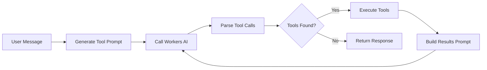

# Cloudflare Workers AI Setup Guide

## 📋 ภาพรวม

โค้ดของคุณรองรับการใช้ Cloudflare Workers AI ซึ่งเป็นบริการ AI ที่มีประสิทธิภาพและราคาถูก โดยสามารถเรียกใช้ tool จาก Agent AI ของคุณและตอบกลับเป็นภาษาไทย

## 🎯 โมเดลที่แนะนำ

### สำหรับภาษาไทยและ Reasoning

```
WORKERS_MODEL=@cf/deepseek-ai/deepseek-r1-distill-qwen-32b
```

**ข้อดี:**
- ✅ รองรับภาษาไทยและพหุภาษา
- ✅ Reasoning capability ดี
- ✅ ความสมดุลที่ดีระหว่างความเร็วและคุณภาพ
- ✅ ราคาประหยัด

### โมเดลทางเลือกอื่น

| โมเดล | ข้อดี | ข้อเสีย |
|--------|--------|---------|
| `@cf/qwen/qwen-2.5-7b-instruct` | คุณภาพสูง, Thai support, รวดเร็ว | ไม่มี |
| `@cf/meta/llama-3.1-8b-instruct` | Meta's Llama, Thai support, ทั่วไป | Reasoning จำกัด |
| `@cf/qwen/qwen-2.5-3b-instruct` | มีความทรงจำดี, Thai support | น้อยกว่า 7B |
| `@cf/mistral-ai/mistral-7b-instruct-v0.3` | Mistral model, มาตรฐานดี | Reasoning จำกัด |

## 🔧 การตั้งค่า

### 1. สร้างหรือแก้ไข `.dev.vars`

```bash
# เลือก provider
AI_PROVIDER=workers

# กำหนด Workers AI model
WORKERS_MODEL=@cf/deepseek-ai/deepseek-r1-distill-qwen-32b

# หรือหากใช้ Gateway (ทำงานได้เหมือนกัน)
# GATEWAY_BASE_URL=https://api.cloudflare.com
# GATEWAY_AUTH_TOKEN=your-cloudflare-token
```

### 2. ปรับใช้กับ Wrangler

ใน `wrangler.jsonc` ของคุณ มี binding AI อยู่แล้ว:

```jsonc
"ai": {
  "binding": "AI",
  "remote": true
}
```

### 3. ทดสอบการเชื่อมต่อ

```bash
npm run dev
# เยี่ยมชม http://localhost:5173/workers-test
```

ก็ควรเห็นผลลัพธ์เช่นนี้:

```json
{
  "ok": true,
  "provider": "workers",
  "model": "@cf/deepseek-ai/deepseek-r1-distill-qwen-32b",
  "text": "pong-from-workers-ai"
}
```

## 🛠️ วิธีการทำงาน

### Tool Calling Flow



### ระบบการจัดการเครื่องมือ

1. **System Prompt Generation** (`generateToolCallingSystemPrompt`)
   - แปลง tools เป็นรูปแบบ XML
   - สอนโมเดลวิธีเรียกใช้ tool

2. **Tool Call Parsing** (`parseToolCalls`)
   - ค้นหา `<tool_use>` blocks
   - แยก tool name และ parameters

3. **Tool Execution** (`executeToolCalls`)
   - เรียกใช้ tool ด้วย parameters
   - เก็บผลลัพธ์

4. **Response Building** (`buildToolResultsPrompt`)
   - ส่งผลลัพธ์กลับไปยังโมเดล
   - ขอให้ตอบสนอง

## 📝 ตัวอย่าง Tool Definition

```typescript
import { tool } from "ai";
import { z } from "zod/v3";

const getWeather = tool({
  description: "Get weather for a city",
  inputSchema: z.object({ 
    city: z.string().describe("City name in any language") 
  }),
  execute: async ({ city }) => {
    // Your implementation
    return `Weather in ${city}: Sunny, 25°C`;
  }
});
```

## 🌍 การรองรับภาษาไทย

โค้ดของคุณสอนโมเดลให้:

1. **ตรวจจับภาษาโดยอัตโนมัติ**
   ```
   Always respond in the same language as the user's question.
   If user writes in Thai, respond in Thai.
   If user writes in English, respond in English.
   ```

2. **โมเดลที่รองรับไทย**
   - DeepSeek รุ่นทั้งหมด
   - Qwen 2.5 รุ่นทั้งหมด
   - Llama 3.x รุ่นทั้งหมด
   - Mistral 7B v0.3

## 🚀 ติดตั้งและรัน

```bash
# ติดตั้ง dependencies
npm install

# ทดสอบ development
npm run dev

# ก่อน deploy ลง production
npm run build

# Deploy กับ Wrangler
wrangler deploy
```

## 📚 API Reference

### `callWorkersAI(env, prompt): Promise<string>`

เรียกใช้ Workers AI โดยตรง

```typescript
const response = await callWorkersAI(env, "สวัสดี!");
```

### `processMessageWithWorkersAI(env, userMessage, systemPrompt, allTools, maxIterations)`

ประมวลผลข้อความพร้อม tool calling

```typescript
const { text, toolsUsed } = await processMessageWithWorkersAI(
  env,
  "บอกฉันเกี่ยวกับสภาพอากาศในกรุงเทพฯ",
  systemPrompt,
  allTools,
  2
);
```

## 🔍 Debugging

### ตรวจสอบ Tool Calls

เปิดใช้งานบันทึกในไฟล์ `src/server.ts`:

```typescript
console.log(`✓ Tools used: ${toolsUsed.join(", ")}`);
```

### ตรวจสอบ Gateway Configuration

```bash
curl http://localhost:5173/check-open-ai-key
# ควรแสดง:
# {
#   "success": true,
#   "gatewayConfigured": false (หากไม่ได้ตั้งค่า Gateway)
# }
```

## 🐛 การแก้ปัญหาทั่วไป

### ข้อผิดพลาด: "Workers AI binding 'AI' is not configured"

**วิธีแก้:** ตรวจสอบว่ามี binding AI ใน `wrangler.jsonc` และใช้ `wrangler dev` เพื่อเรียกใช้

### โมเดลตอบไม่เป็นภาษาไทย

**วิธีแก้:** 
1. ลองใช้โมเดลที่เพิ่งเสนอ (DeepSeek)
2. ตรวจสอบ system prompt ที่มีคำแนะนำภาษา
3. ลองส่งข้อความภาษาไทยที่ชัดเจน

### Tool ไม่ถูกเรียก

**วิธีแก้:**
1. ตรวจสอบการคืน XML ของโมเดล
2. เปิด console.log ใน `parseToolCalls()`
3. ทำให้ prompt ชัดเจนเมื่อจะใช้ tools

## 📖 การอ้างอิงเพิ่มเติม

- [Cloudflare AI Docs](https://developers.cloudflare.com/ai)
- [Vercel AI SDK](https://sdk.vercel.ai)
- [DeepSeek Docs](https://api-docs.deepseek.com)
- [Qwen Models](https://github.com/QwenLM/Qwen)
